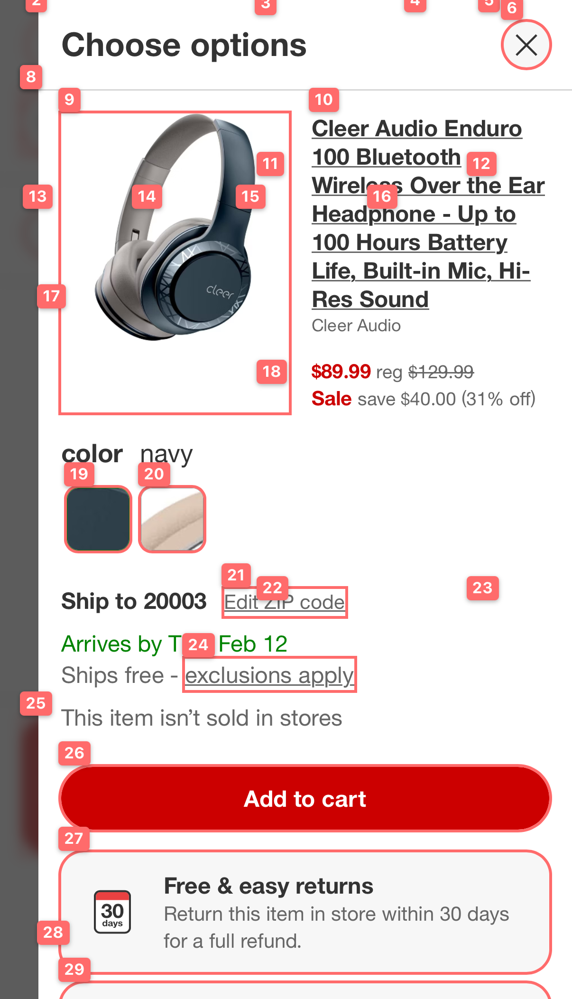

# ATL — Agent Touch Layer

> The automation layer between AI agents and iOS

Fast browser automation via iOS Simulator. Built for AI agents — complete tasks in minimal API calls with a mark-and-click system that doesn't break.


*Numbered marks on interactive elements — no vision model needed to know what to click*

## Quick Start

```bash
git clone https://github.com/JordanCoin/Atl.git
cd atl
./bin/atl start
```

API ready at `http://localhost:9222`.

## The Pattern

Every page interaction is 3 calls:

```
goto → markAll → clickMark
```

That's it. No CSS selectors, no XPath, no DOM inspection. Just:
1. Go to page
2. Mark everything (get labels + text)
3. Click by number

## Cart Flow Example

```bash
./bin/cart bestbuy "wireless earbuds"
```

Returns:
```json
{
  "success": true,
  "merchant": "bestbuy",
  "step": "complete",
  "warnings": [],
  "cart": {
    "items": 1,
    "total": "$211.99"
  },
  "pdf": "Screenshots/bestbuy-cart-20251230-232143.pdf"
}
```

**5 API calls total.** ~10 seconds per cart. **~360 carts/hour.**

Always returns a PDF of final state → [example cart PDF](Screenshots/bestbuy-cart-20251230-234958.pdf)

Supported merchants: `amazon`, `bestbuy`, `ebay`, `target`, `walmart`, `homedepot`

## How markAll Works

```bash
curl -X POST http://localhost:9222/command \
  -d '{"id":"1","method":"markAll"}'
```

Returns every interactive element with a label number:
```json
{
  "result": {
    "count": 153,
    "elements": [
      {"label": 0, "text": "Home", "href": "..."},
      {"label": 25, "text": "Add to cart", "selector": "button.add-to-cart"},
      ...
    ]
  }
}
```

Then click by label:
```bash
curl -X POST http://localhost:9222/command \
  -d '{"id":"2","method":"clickMark","params":{"label":25}}'
```

## Finding Elements

**Programmatic** - search the JSON:
```bash
curl ... -d '{"method":"markAll"}' | jq '[.result.elements[] | select(.text | test("add to cart"; "i"))]'
```

**Visual** - look at the PDF:
```bash
curl ... -d '{"method":"screenshot","params":{"fullPage":true}}' | jq -r '.result.data' | base64 -d > page.pdf
```

The PDF shows numbered labels on every element.

## Full API

### Navigation
| Command | Parameters | Description |
|---------|------------|-------------|
| `goto` | `{url}` | Navigate to URL |
| `reload` | - | Reload page |
| `back` | - | Go back |
| `forward` | - | Go forward |

### Marking & Clicking
| Command | Parameters | Description |
|---------|------------|-------------|
| `markAll` | - | Label ALL elements on page (recommended) |
| `markElements` | - | Label viewport-visible only |
| `clickMark` | `{label}` | Click by label number |
| `unmarkElements` | - | Remove labels |

### Forms
| Command | Parameters | Description |
|---------|------------|-------------|
| `fill` | `{selector, value}` | Fill input field |
| `type` | `{text}` | Type into focused element |
| `press` | `{key}` | Press key (Enter, Tab, etc.) |
| `click` | `{selector}` | Click by CSS selector |

### Capture
| Command | Parameters | Description |
|---------|------------|-------------|
| `screenshot` | `{fullPage?}` | PNG viewport or PDF full page |
| `captureLight` | - | Text + interactives only (~99% smaller) |

### Query
| Command | Parameters | Description |
|---------|------------|-------------|
| `querySelector` | `{selector}` | Get element info |
| `querySelectorAll` | `{selector}` | Get all matching elements |
| `waitForSelector` | `{selector}` | Wait for element |

### Touch Gestures
| Command | Parameters | Description |
|---------|------------|-------------|
| `tap` | `{x, y}` | Tap at coordinates |
| `longPress` | `{x, y, duration?}` | Long press (default 0.5s) |
| `swipe` | `{direction}` or `{fromX, fromY, toX, toY}` | Swipe up/down/left/right |
| `pinch` | `{scale}` | Pinch zoom (scale > 1 = zoom in) |
| `getMarkInfo` | `{label}` | Get element coordinates by label |

**Vision-free coordinate workflow:**
```bash
# 1. Mark elements
curl -X POST http://localhost:9222/command -d '{"method":"markAll"}'

# 2. Get coordinates for element 26
curl -X POST http://localhost:9222/command -d '{"method":"getMarkInfo","params":{"label":26}}'
# → {"x":43, "y":539, "width":343, "height":44, "text":"Add to cart"}

# 3. Tap at center of element
curl -X POST http://localhost:9222/command -d '{"method":"tap","params":{"x":214,"y":561}}'
```

## Why PDFs?

- **Searchable text** - no OCR needed
- **Full page** - entire scrollable content
- **Smaller** - text-heavy pages compress well
- **Multimodal** - send directly to Claude/GPT-4V for analysis

## Using with AI Agents

### OpenClaw Skill (Recommended)

Full skill with docs, helper scripts, and best practices: **[skill/](skill/)**

```bash
# Install from this repo
git clone https://github.com/JordanCoin/Atl.git
openclaw skills install ./Atl/core/skill

# Or if you already have the repo cloned
openclaw skills install ./skill
```

The skill includes:
- Complete API documentation
- Vision-free automation workflow (no GPT-4V costs!)
- Escalation ladder (coordinates → vision → JS injection)
- Bash helper functions (`atl_tap`, `atl_swipe`, `atl_mark`, etc.)
- Real-world e-commerce checkout patterns

### Manual / Other AI Agents

The HTTP API is simple enough for any agent to use directly:

1. **Mark elements:** `POST /command` with `{"method":"markAll"}` → get labeled elements
2. **Find by text:** Search the JSON for buttons/links you want
3. **Click by label:** `{"method":"clickMark","params":{"label":25}}`
4. **Screenshot if stuck:** `{"method":"screenshot"}` → see what's blocking you

See [BROWSER-AUTOMATION.md](BROWSER-AUTOMATION.md) for a quick-start guide, or dive into the full [skill documentation](skill/SKILL.md).

## CLI

```bash
./bin/atl start   # Boot simulator, start server
./bin/atl stop    # Stop the app
./bin/atl status  # Check if running

./bin/cart <merchant> [search]  # Run cart flow
```

## Error Handling

On failure, you always get:
- `success: false`
- `step` - where it failed
- `error` - what went wrong
- `pdf` - screenshot of failure state

```json
{
  "success": false,
  "step": "find_add_to_cart",
  "error": "No Add to Cart button found",
  "pdf": "Screenshots/target-cart-20251230-232318.pdf"
}
```

Look at the PDF to see what went wrong.

## Security

ATL runs an **unauthenticated HTTP server** on port 9222. This is designed for local development only.

- The server binds to `127.0.0.1` (localhost) and rejects external connections
- Never expose port 9222 to the network or internet
- Never run ATL on a shared machine with untrusted users
- The server has full control over the browser - treat it like a debug port

## Requirements

- macOS with Xcode (for iOS Simulator)
- No build step - pre-built app included

## License

MIT
